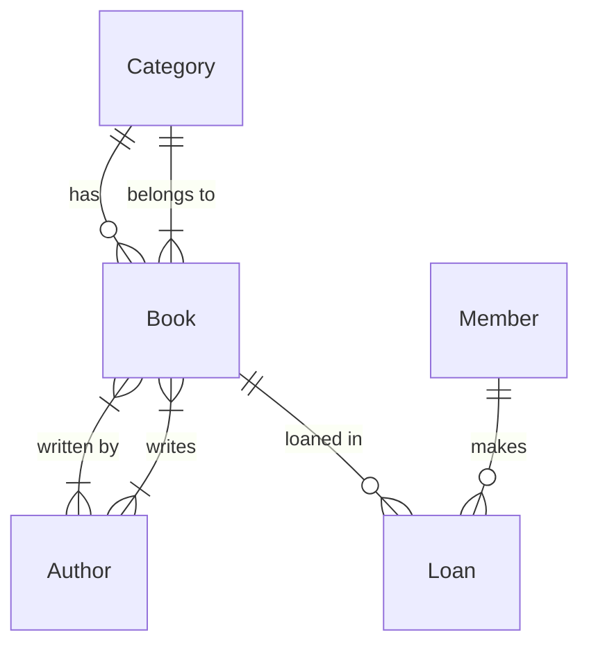

# Library Management System Database

## Project Description
This project implements a comprehensive Library Management System database using MySQL. The database is designed to handle book inventory, member management, and loan tracking for a library system.

## Features
- Book management with ISBN tracking
- Author management with multiple authors per book support
- Category-based book organization
- Member management with unique email tracking
- Loan tracking system with due dates and return status

## Database Schema
The database consists of the following tables:
- `Category`: Stores book categories
- `Author`: Stores author information
- `Book`: Stores book details with category reference
- `BookAuthor`: Junction table for many-to-many relationship between books and authors
- `Member`: Stores library member information
- `Loan`: Tracks book loans with due dates and return status

## Entity Relationship Diagram (ERD)


## Setup Instructions

### Prerequisites
- MySQL Server (version 5.7 or higher)
- MySQL Workbench or any MySQL client

### Importing the Database
1. Open your MySQL client
2. Create a new database:
   ```sql
   CREATE DATABASE library_management;
   USE library_management;
   ```
3. Import the SQL file:
   ```sql
   source path/to/library_management.sql
   ```

## File Structure
- `library_management.sql`: Contains all database creation scripts with proper constraints and relationships

## Database Constraints
- Primary Keys: All tables have auto-incrementing primary keys
- Foreign Keys: Proper referential integrity maintained between tables
- Unique Constraints: ISBN numbers and member emails are unique
- Not Null Constraints: Essential fields are marked as NOT NULL

## Relationships
- One-to-Many: Category to Books
- Many-to-Many: Books to Authors (through BookAuthor junction table)
- One-to-Many: Books to Loans
- One-to-Many: Members to Loans 